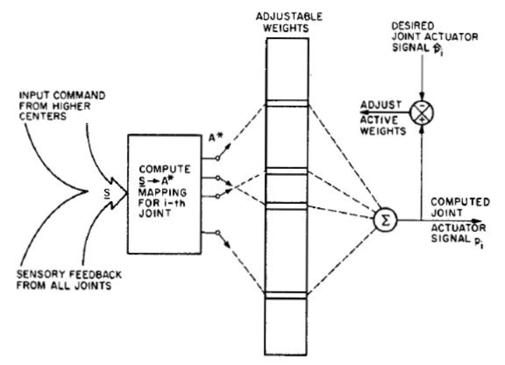
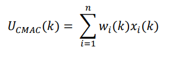
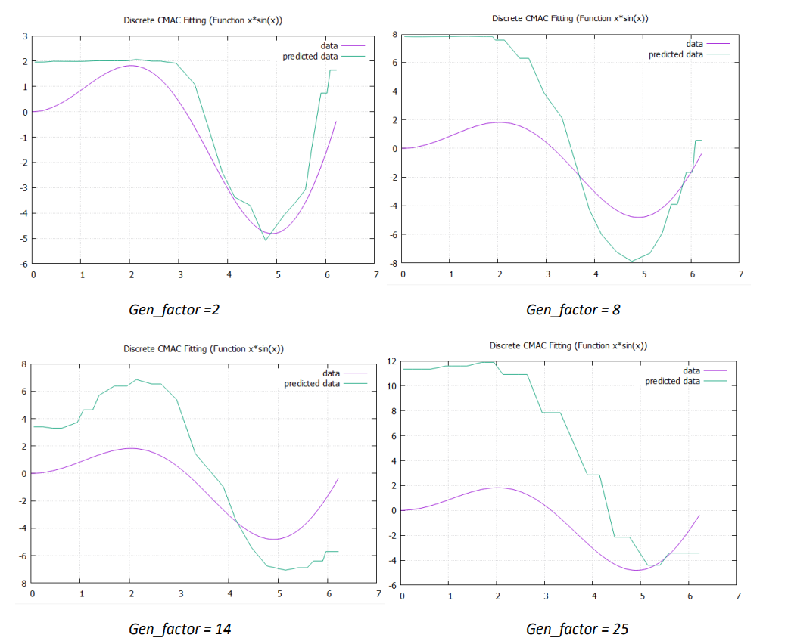
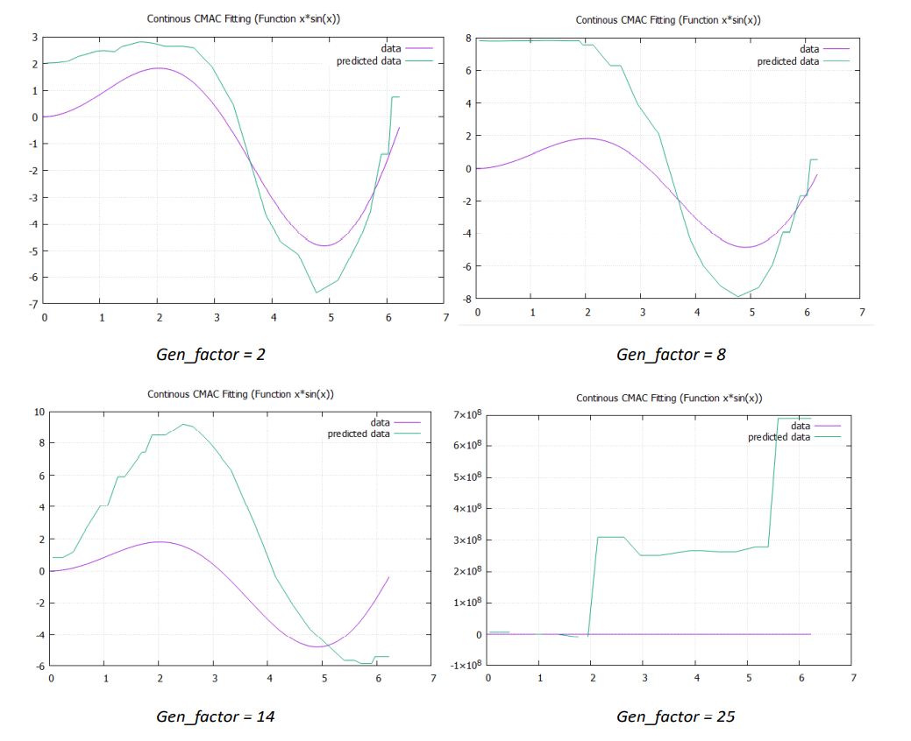

# Cerebellar-Model-Articulation-Controller
---
## Overview

The CMAC was first proposed as a function modeler for robotic controllers by James Albus in 1975[1] (hence the name), but has been extensively used in reinforcement learning and also as for automated classification in the machine learning community. The CMAC is an extension of the perceptron model. 

It computes a function for n input dimensions. The input space is divided up into hyper-rectangles, each of which is associated with a memory cell. The contents of the memory cells are the weights, which are adjusted during training. Usually, more than one quantisation of input space is used, so that any point in input space is associated with a number of hyper-rectangles, and therefore with a number of memory cells. The output of a CMAC is the algebraic sum of the weights in all the memory cells activated by the input point.



---
## Methodology

----
### Dicrete CMAC

1) We take input space of 100 points between 0 to 2pi and we take the generalization factor as 2 and num of weights as 35.

2) Then, we randomly sample these points and divide them into 70:30 ratio for training and testing the algorithm.

3) Now we need to map the input 70 points to association space and multiply these elements with the weights and sum them to get the output:



4) To find the size of association vector that are mapped to the Association Matrix we use below formula:
  Association Vector Size = Num of weights – Generalization Factor + 1

5) We will be hashing contiguous regions (sliding window) to avoid storing random weight indices, therefore we will design the hash function proportionately and will store the start index of the weight vector in the Association Map. This will help us ascertain the active weights for each association element.

6) During training for each input, we will perform following steps:
  a. Get the active weights for that input.
  b. Sum the weights values (similar to multiply that input by 1 for the active weights and 0 for inactive weights and summing all values).
  c. Then we find the difference between the predicted value and actual value.
  d. Further, we use this difference to update the active weights using below formula:
        ```
        𝑤𝑡+1 = 𝑤𝑡 + (𝑒 ∗ α)/𝑔𝑓   
        
        where,
          𝑤𝑡+1 is weight at iteration t+1
          𝑤𝑡
          is weight at iteration
          e is error
          α is learning rate
          gf = generalization factor
          
        ```
        
  e. This process is repeated until a predefined convergence threshold.
  
7) We use the trained network to predict the values of the test data (30 points) and find 
their accuracy. Finally, we plot them to visualize the results.



----
### Continous CMAC

1) We follow similar process to Dicrete CMAC to train the Continous CMAC network.Similarly we train it on a 1d function i.e. x*sin(x), to see the effect of overlap area on 
generalization.

2) As an add on, here we consider the proportion of weights based on the input values to calculate the sum of weights for the output.

3) We consider the partial overlap of the sliding window to calculate appropriate proporions to multiply with the active weight elements.

4) The training, prediction and convergence process are similar to the Discrete CMAC class.



---
## Dependencies

- Windows 10 (Operating System)
- C++ 14
- vcpkg (Package Manager)/CMake (Build System)
- Boost 1.78.0
- gnuplot 5.4.3[http://www.gnuplot.info/]
- gnuplot-iostream[https://github.com/dstahlke/gnuplot-iostream]

---
## Licence
    ```
    MIT License

    Copyright (c) 2021 Paras Savnani

    Permission is hereby granted, free of charge, to any person obtaining a copy
    of this software and associated documentation files (the "Software"), to deal
    in the Software without restriction, including without limitation the rights
    to use, copy, modify, merge, publish, distribute, sublicense, and/or sell
    copies of the Software, and to permit persons to whom the Software is
    furnished to do so, subject to the following conditions:

    The above copyright notice and this permission notice shall be included in all
    copies or substantial portions of the Software.

    THE SOFTWARE IS PROVIDED "AS IS", WITHOUT WARRANTY OF ANY KIND, EXPRESS OR
    IMPLIED, INCLUDING BUT NOT LIMITED TO THE WARRANTIES OF MERCHANTABILITY,
    FITNESS FOR A PARTICULAR PURPOSE AND NONINFRINGEMENT. IN NO EVENT SHALL THE
    AUTHORS OR COPYRIGHT HOLDERS BE LIABLE FOR ANY CLAIM, DAMAGES OR OTHER
    LIABILITY, WHETHER IN AN ACTION OF CONTRACT, TORT OR OTHERWISE, ARISING FROM,
    OUT OF OR IN CONNECTION WITH THE SOFTWARE OR THE USE OR OTHER DEALINGS IN THE
    SOFTWARE.

    ```
